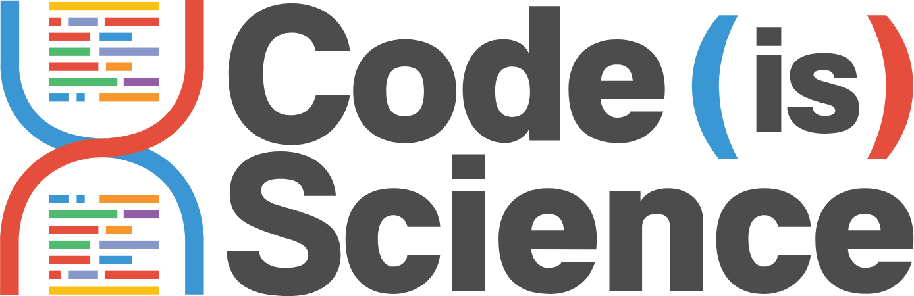

 

# Code is science!

Code is Science works with the scientific coding community to champion Open Source code, so we can ensure that code is peer reviewed and [FAIR](https://www.nature.com/articles/sdata201618).

For more details about our mission see [CodeIsScience.com](http://www.codeisscience.com). If you'd like to **contribute** (including Mozilla Global Sprint volunteers!), head to [CONTRIBUTING.md](CONTRIBUTING.md) or straight to our [issues list](https://github.com/yochannah/code-is-science/issues)! PS, have I mentioned how awesome you are for considering it? :heart-eyes:

## What is this repo about?
In this repository you can find all our different logos.
You will be able to find different logos related to multiple scientific disciplines.

## Contact
We have a [gitter room](https://gitter.im/codeisscience/Lobby#)!

## Credits 

### Contributors

This project exists thanks to all the people who contribute. [[Contribute](CONTRIBUTING.md)].

### Backers

Thank you to all our backers! 🙏 [[Become a backer](https://opencollective.com/code-is-science#backer)]

### Sponsors

Support this project by becoming a sponsor. Your logo will show up here with a link to your website. [[Become a sponsor](https://opencollective.com/code-is-science#sponsor)]

